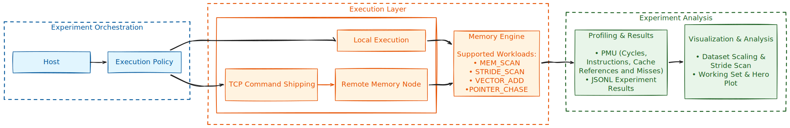

# Aletheia

Aletheia is a memory-centric experimentation framework for exploring Processing Near Memory (PNM) concepts using commodity hardware. It adopts a distributed host/node architecture in which memory intensive workloads are shipped to a remote memory node for execution, allowing computation to be performed closer to the dataset while supporting detailed performance analysis..

Rather than attempting to emulate specialized PNM hardware, Aletheia provides a reproducible platform for studying memory behavior. The framework combines configurable execution policies, memory-centric workloads, hardware performance counter (PMU) collection, and automated visualization to investigate how access patterns interact with the memory hierarchy.

## Motivation

Modern processors continue to become faster, yet memory latency improves at a much slower pace. As applications process increasingly larger datasets, the cost of moving data between memory and compute has become a major performance bottleneck. This imbalance, commonly referred to as the Memory Wall, has motivated research into Processing Near Memory (PNM) architectures, where computation is performed closer to the data to reduce unnecessary movement.


> Figure: CPU performance vs DRAM performance over time.  
> Source: Computer Architecture: A Quantitative Approach, Hennessy & Patterson.

Evaluating these ideas often requires specialized hardware that is inaccessible to most students and researchers. Aletheia was developed to bridge that gap by providing an experimental framework that captures many of the architectural principles behind memory centric execution while remaining deployable on commodity systems.

## System Overview

<p align="center">
  
</p>

Aletheia follows a distributed host/node architecture that separates experiment orchestration from workload execution. Inspired by the execution model proposed in the [SimplePIM](https://arxiv.org/pdf/2310.01893) framework, the host coordinates experiments through configurable execution policies, allowing identical workloads to execute either locally or on a remote memory node through TCP command shipping. This abstraction enables the same workload to run across different execution environments without changing the experimental workflow.

Across both execution modes, the framework uses a common Memory Engine to execute memory-centric workloads, collect hardware performance counters (PMU), and export structured JSONL results. These results are processed by an automated visualization pipeline, enabling reproducible analysis of memory behavior across multiple experiments.

## Experimental Methodology

Aletheia provides a reproducible framework for evaluating memory-centric workloads under different execution policies. Each experiment follows the same execution pipeline, beginning with workload selection, followed by execution on either the local host or a remote memory node. During execution, timing information and, where available, hardware performance counters are collected to capture low-level architectural behavior, and the resulting measurements are exported as structured JSONL files for post-processing.

The framework currently includes three experiment suites and one aggregate visualization:

- **Dataset Scaling** - Evaluates how execution time changes as dataset size increases.
- **Stride Scan** - Studies the effect of memory access stride on cache utilization and runtime.
- **Working Set Sweep** - Characterizes cache hierarchy behavior by varying the active working set size for sequential, random, and pointer-chasing access patterns.
- **Hero Plot** - Combines the working-set experiments to visualize how different memory access patterns interact with the cache hierarchy.

## Experimental Results

The Hero Plot summarizes the behavior of Aletheia's working-set experiments by comparing sequential, random, and pointer-chasing memory access patterns across increasing working-set sizes. Together, these workloads expose how different access patterns interact with the processor's cache hierarchy and memory subsystem.

<p align="center">
  
</p>

Sequential accesses maintain high cache locality and benefit from hardware prefetching, resulting in comparatively stable execution times until the working set exceeds the capacity of successive cache levels. Random accesses reduce spatial locality, while pointer-chasing introduces strict data dependencies that limit memory-level parallelism and expose the full cost of cache misses. The resulting transitions reveal the effects of the underlying cache hierarchy, illustrating how access patterns fundamentally influence memory performance.

## Repository Structure

```text
├── src/
│   ├── bin/          # Host and Memory Node executables
│   ├── engine/       # Memory Engine implementation
│   ├── runtime/      # Execution policies
│   ├── workloads/    # Memory-centric workloads
│   ├── network.rs    # Host <-> Node communication
│   ├── profiler.rs   # Hardware PMU integration
│   ├── protocol.rs   # Command and response protocol
│   └── results.rs    # Experiment result handling
├── results/          # JSONL experiment outputs
├── viz/              # Visualization scripts
├── README.md
├── Makefile
└── Cargo.toml
```

## Getting Started

### Clone and Build

```bash
git clone https://github.com/pranav0x2212/Aletheia.git
cd Aletheia
cargo build --release
```

### Start the Memory Node

```bash
make node
```

### Run Experiments

```bash
make scaling      # Dataset Scaling
make strides      # Stride Scan
make wsweep       # Working Set Sweep
```

### Generate Visualizations

```bash
make plot-scaling
make plot-stride
make plot-hero

# or generate all figures
make plots
```

Run `make help` to view the complete list of available commands.

## Future Work

Aletheia is intended to serve as a foundation for future research into memory-centric computing. Planned directions include richer workload implementations, additional hardware performance counter support and evaluation on FPGA-based or emerging processing-near-memory platforms.

## Acknowledgements

Aletheia draws inspiration from the broader body of research on Processing Near Memory (PNM) and memory-centric computing. In particular, the execution policy abstraction was influenced by the design philosophy presented in the [SimplePIM framework](https://arxiv.org/pdf/2310.01893), while the project's broader motivation is rooted in the Processing-in-Memory research pioneered by the [SAFARI Research Group at ETH Zurich](https://safari.ethz.ch/), led by Prof. Onur Mutlu. The ideas presented in these works helped shape the architectural direction of Aletheia, while the implementation and experimental framework presented here are entirely original.